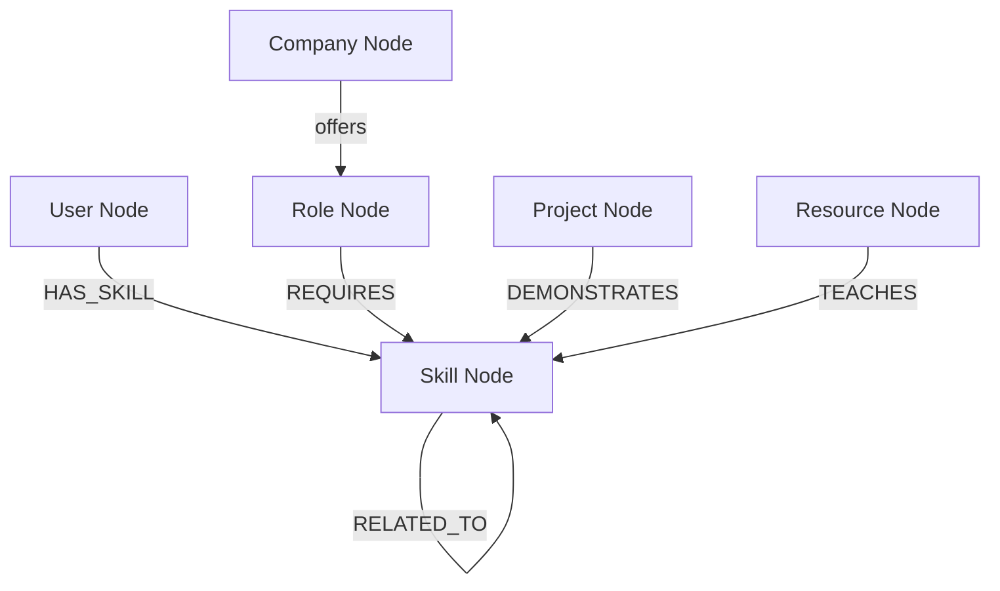

# CareerGraph: Skill & Career Path Explorer

CareerGraph is a polished, graph-powered web application designed to help learners explore career pathways, identify skill gaps for specific roles, visualize skill relationships, and retrieve tailored educational resources. It uses **CognoDB** (a managed graph database speaking openCypher) for graph storage and traversals, a **Node.js/Express** backend, and a **React/Vite** frontend with custom styling.

---

## 1. Project Overview & The Problem Solved

Traditional career development platforms treat user skills, career roles, and learning courses as independent rows in relational tables. Finding career trajectories requires complex, recursive, and expensive join operations. 

**CareerGraph** models these entities as nodes and relationships in a graph. This enables:
*   **Dynamic Compatibility Scoring**: Evaluating matches by checking overlapping paths between a user's skills and a role's requirements.
*   **Path Traversal & Pre-requisites**: Explaining *how* to acquire a target skill by traversing relationships between related skills (e.g., matching SQL $\to$ Postgres $\to$ Backend Engineer).
*   **Resource Mapping**: Connecting educational content directly to specific missing skills required for roles.

---

## 2. Why a Graph Database? (vs. Relational Schema)

In a relational database (SQL), modeling a system of user skills, related skills, career pre-requisites, learning resources, and role openings requires multiple join tables (e.g., `Users`, `Skills`, `UserSkills`, `SkillRelations`, `RoleSkills`, `Resources`, `ResourceSkills`).

**Problems with Relational/SQL:**
1.  **Multiple Joins**: Querying recommendations or gaps requires joining 4 to 6 tables, which degrades performance at scale.
2.  **Recursive Queries**: To find path connections (e.g., "Skill A is related to Skill B, which is related to Skill C required for Role X"), SQL requires writing complex Common Table Expressions (CTEs) or recursive joins.

**Advantages of Graph (CognoDB / Cypher):**
1.  **Relationships as First-Class Citizens**: Connections (`HAS_SKILL`, `RELATED_TO`, `REQUIRES`) are traversed in $O(1)$ time without index lookups or tables joins.
2.  **Clean & Declarative Queries**: Finding the shortest learning path is written with a simple `shortestPath((s1)-[:RELATED_TO*0..5]->(s2))` query, rather than hundreds of lines of SQL CTEs.
3.  **Flexible Schema**: Adding new nodes or relationship attributes (like relationship `strength` or `importance`) does not require migrations or schema alterations.

---

## 3. Graph Data Model

### Node Types

| Node Type | Properties | Purpose |
|---|---|---|
| **User** | `id`, `name` | Represents the learner exploring their career path. |
| **Skill** | `id`, `name`, `category` | A technical, professional, or soft skill. |
| **Role** | `id`, `title`, `level` | A target job role (e.g., junior developer, backend lead). |
| **Company** | `id`, `name` | An organization hiring for career roles. |
| **Project** | `id`, `name`, `description` | A project showcasing specific skills. |
| **Resource** | `id`, `title`, `type`, `url` | A course, book, or video teaching a skill. |

### Relationships

*   `(User)-[:HAS_SKILL]->(Skill)`: The skills currently possessed by a user.
*   `(Skill)-[:RELATED_TO {strength: Float}]->(Skill)`: How closely two skills are connected in a domain.
*   `(Role)-[:REQUIRES {importance: String}]->(Skill)`: Skills required to succeed in a job role.
*   `(Project)-[:DEMONSTRATES]->(Skill)`: Hands-on proof of skill mastery.
*   `(Resource)-[:TEACHES]->(Skill)`: Learning content that covers a skill.
*   `(Company)-[:OFFERS]->(Role)`: A company offering a career position.

### Data Model Schema (Mermaid Diagram)



---

## 4. Key Graph Queries (openCypher)

The application utilizes parameterized queries via the official Neo4j driver.

### Query 1: Role Recommendations
Calculates the skill compatibility percentage for a user across all roles in the graph database.
```cypher
MATCH (u:User {id: $userId})-[:HAS_SKILL]->(owned:Skill)
WITH u, collect(owned.id) AS ownedIds
MATCH (r:Role)-[:REQUIRES]->(required:Skill)
WITH r, ownedIds,
     count(required) AS total,
     sum(CASE WHEN required.id IN ownedIds THEN 1 ELSE 0 END) AS matched
RETURN r.id AS id,
       r.title AS title,
       r.level AS level,
       total,
       matched,
       CASE WHEN total = 0 THEN 0
       ELSE round((100.0 * matched) / total) END AS matchPercent
ORDER BY matchPercent DESC
```

### Query 2: Multi-hop Career Path Discovery
Traverses the graph up to 5 steps of `RELATED_TO` relationships to show how the user can transition from their current skills to a role's requirements.
```cypher
MATCH (u:User {id: $userId})
MATCH (u)-[:HAS_SKILL]->(owned:Skill)
MATCH (r:Role {id: $roleId})-[:REQUIRES]->(req:Skill)
WHERE NOT (u)-[:HAS_SKILL]->(req)
MATCH p = shortestPath((owned)-[:RELATED_TO*0..5]->(req))
RETURN [n IN nodes(p) | {id: n.id, name: n.name, category: n.category}] AS skillNodes,
       length(p) AS len
ORDER BY len DESC
LIMIT 1
```

### Query 3: Skill Gaps Analysis
Compares the user's current skills against the target role requirements to isolate what is missing.
```cypher
MATCH (r:Role {id: $roleId})-[:REQUIRES]->(required:Skill)
OPTIONAL MATCH (u:User {id: $userId})-[h:HAS_SKILL]->(required)
RETURN required.id AS id,
       required.name AS name,
       required.category AS category,
       h IS NOT NULL AS isOwned
ORDER BY required.category, required.name
```

---

## 5. Technology Stack

*   **Frontend**: React, Lucide Icons, Custom CSS.
*   **Backend**: Node.js, Express, Cors, dotenv.
*   **Database**: CognoDB (Bolt connection protocol, Neo4j JS Driver). 

---

## 6. Architecture & Project Structure

```text
careergraph/
├── client/                 # React frontend
│   ├── src/
│   │   ├── services/
│   │   │   └── api.js      # Fetch wrapper for backend endpoints
│   │   ├── App.jsx         # Main dashboard interface
│   │   ├── index.css       # Custom Glassmorphism styles
│   │   └── main.jsx
│   ├── package.json
│   └── vite.config.js       
├── server/                 # Express backend
│   ├── src/
│   │   ├── config/
│   │   │   └── database.js # CognoDB connection pooling
│   │   ├── controllers/
│   │   │   └── controllers.js # Query controllers and endpoints
│   │   ├── routes/
│   │   │   └── routes.js   # API route definitions
│   │   └── app.js          # Express app 
│   ├── .env.example
│   └── package.json
├── database/
│   ├── seed.js             # Realistic dataset seeder
│   └── queries.cypher      # Reference Cypher queries
├── package.json            
└── README.md
```

---

## 7. Installation & Setup

### Prerequisites
*   Node.js (v18+)
*   npm

### 1. Provision CognoDB Instance
1.  Sign up at [CognoDB Console](https://console.cognodb.com/signup).
2.  Create a free `c0` instance.

### 2. Configure Environment Variables

Fill in the details:
```env
PORT=5000
COGNODB_URI=bolt+s://<instance-id>.databases.cognodb.com
COGNODB_USER=cognodb
COGNODB_PASSWORD=<your-cogodb-password>
```


### 3. Install Dependencies
Run the installation script from the root project directory:
```bash
npm run install:all
```
This installs dependencies in the root, `client`, and `server` folders.

### 4. Seed the Database
Deploy the initial seed data structure containing 10 users, 40+ skills, 12 roles, and 100+ relationships:
```bash
npm run seed
```

### 5. Run the Application Locally
Launch the client and server concurrently:
```bash
npm run dev
```


---

## 8. UI Highlights & Screenshots

1.  **Skills Selection Dashboard**: A dashboard to review your skills, dynamically add new ones, or remove skills at runtime.
2.  **Role Exploration Modal**: Explores individual roles showing matching skills, missing skills, direct learning resource suggestions, and a Career Path traversal path graph.
3.  **Legible Theme**: Curated user drop-down lists with high-contrast dark backgrounds matching the dark-mode theme.

---

## 9. Known Limitations & Future Improvements
*   **Write operations concurrency**: Seed scripts reset database constraints. Future releases could support multiple concurrent user sessions with authenticated state.
*   **Dynamic Path Customization**: Allowing the user to select which intermediary skills to prioritize when calculating career paths.
